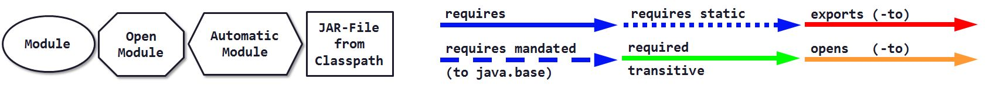

# DepVis (Java 9 Jigsaw Dependency Visualizer)

### Info
Written by [Martin Lehmann](https://github.com/MartinLehmann1971), [Kristine Schaal](https://github.com/kristines) and [Rüdiger Grammes](https://github.com/rgrammes) 

Version 0.3

see https://github.com/accso/java9-jigsaw-depvis

### What is this about?
DepVis visualizes dependencies of Java 9 Jigsaw modules as defined in 
[Project Jigsaw](http://openjdk.java.net/projects/jigsaw/) by [JSR 376]
(https://www.jcp.org/en/jsr/detail?id=376) and [JEP 261](http://openjdk.java.net/jeps/261). 
DepVis produces a [GraphViz](http://www.graphviz.org) output file (DOT file) which can be rendered with GraphViz in a separate step.

Result looks like this (in this case all Java 9 system modules (build 181) are visualized with all relationships, limited to modules with prefix "java.*"):

#### DepVis takes into account:
1. Requires/Read relationships (currently visualized as a blue arrow)
   * requires mandated to `java.base` (dashed blue arrow)
   * requires transitive (blue arrow)
   * requires static (dotted blue arrow)
2. Requires transitive transitivity (green arrow)
   * If `moda--requires-transitive-->modb` (blue) and `modc--requires-->moda` (blue), then also `modc--requires-->modb` (green). Note that this is currently limited to 1-transitivity.
2. Exports-To relationships (red)
3. Opens-To relationships (orange)

#### Further hints:
1. DepVis can be configured, see section below.
2. A legend is written in the top left corner. As this unfortunately flips the whole graph, this is done as a separate graph.
3. A helper printer tool is also included which prints the relationship to STDOUT. 

#### Legend

# License
This work has been published under Apache License 2.0. Please refer to file 'LICENSE' for further details.
### Setup
1. Clone this repo.
2. Install a Java 9 JDK with Jigsaw support. DepVis has been tested with Java9 build 181 and also with 9.0.1-11 (both on Windows 10, x64) 
3. Install GraphViz 2.38.
4. If running on Windows, install a bash, like for example [Babun](https://babun.github.io/)
5. Edit file `env.sh` to configure `JAVA_HOME` and `GRAPHVIZ_HOME` (see TODO markers)
6. Also edit file `env.sh` to configure the path separator. If run on Windows, use \; (a blackslash quoting a ;). If you run all stuff on *nix, use a colon : .
7. Call `clean.sh`, `compile.sh` and `run-vis.sh` (or `all.sh` for all in one step).
8. Output is `moduledependencies.dot` and `moduledependencies.png` (and a second file pair `...with-legend`).

### Configuration
DepVis can be configured in a configuration properties file (see depvis.properties) as follows:

1. `depvis.includeFilter`
   * comma-separated Strings
   * module names whitelist, _all_ used to be checked with `String.startsWith`
   * if not set, all modules from system and/or module-path will be used
   * example: `java.,jdk.`
2. `depvis.excludeFilter`   
   * comma-separated Strings
   * module names blacklist, _all_ used to be checked with `String.startsWith`
   * if not set, all modules from system and/or module-path will be used
   * example: `jdk.internal`
3. `depvis.useSystemModules`
   * boolean, default is true
   * do we want to visualize modules from system (i.e. `java.*`, `jdk.*` etc.)?
4. `depvis.useModulePath`
    * boolean, default is true
    * want to visualize modules from a module path
    * if so, `depvis.modulePath` needs to be set
5. `depvis.modulePath`
    * path Strings, separated by system's file separator) 
    * set a local module path
    * example: `/jigsaw/example/mlib`
6. `depvis.showRequires`
    * boolean, default is true
    * want to visualize requires/reads relationships?
7. `depvis.showRequiresMandated`
   * boolean, default is true
   * want to visualize requires/reads mandated relationships?
8. `depvis.showRequiresStatic`
   * boolean, default is true
   * want to visualize requires/reads static relationships?
9. `depvis.showRequiresTransitive`
   * boolean, default is true
   * want to visualize requires/reads transitive relationships (1-transitive)?
10. `depvis.showExports`, only needed for the Printer
    * boolean, default is true
    * want to print exports?
11. `depvis.showExportsTo`
    * boolean, default is true
    * want to visualize exports-to relationships?
12. `depvis.showOpens`, only needed for the Printer
    * boolean, default is true
    * want to print opens?
13. `depvis.showOpensTo`
    * boolean, default is true
    * want to visualize opens-to relationships?
14. `depvis.showUses`
    * boolean, default is true
    * want to print uses?
15. `depvis.showProvided`
    * boolean, default is true
    * want to print provides?
16. `depvis.showContains`, only needed for the Printer
    * boolean, default is true
    * want to print contains, i.e. all concealed packages?
17. `depvis.showMainClass`
    * boolean, default is true
    * want to print the main class?
16. `depvis.prefixWithModuleName`, only needed for the Printer
    * boolean, default is true
    * want to prefix each output line with the module name & version (for easier grep's)?
17. `depvis.outputFileName`, only needed for the Visualizer
    * String
    * filename for the DOT output file
    * example: `/tmp/moduledependencies.dot`
18. `depvis.showLegend`, only needed for the Visualizer
    * boolean, default is true
    * want to visualize a legend plus title and timestamp?
    * if so, the graph will be flipped to LR
19. `depvis.diagramTitle`, only needed for the Visualizer
    * String
    * configure a title for the diagram

### TODOs, LOP, Backlog, Ideas, ...
No software is ready, ever ;-) So here are some ideas left (any other feedback very welcome!):

- [ ] Show requires transitive dependencies with a different line style
- [ ] Include n-transitivity for requires-transitive (currently limited to 1-transitivity)
- [ ] Allow filtering of individual relationships (black/white listing)
- [ ] Include a module's hash value
- [ ] Currently, DepVis only shows modules from the Observable Modules (= module path and system modules). Alternatively allow to show modules from a Configuration.
- [ ] Allow to configure colors, edge styles, node styles/shapes etc. via config file from outside (currently one needs to change Java class depvis.GraphVizHelper.java and recompile).
- [ ] Adding a GraphViz legend seems only possible with `rankdir=LR`. This settings then flips the whole graph (as it cannot be done in a subgraph only). Any way to get around this?
- [ ] Write the package name(s) to an exports-to edge
- [ ] Layouting: Any text added as label to an edge should be visualized "closely"

### Latest changes

#### Migration to Java 9.0.1 (Release)
No changes necessary

#### Latest features, all new in 0.3 
- Include all requires static (both in printer and visualizer - visualized as in dotted blue arrows, also done in the legend)
- Include all opens (only in the printer, not in the visualizer)
- Include all opens-to (both in printer and visualizer - visualized as in orange arrows, also done in the legend)
- Prints all uses and all provides (only in the printer, not in the visualizer)
- Prints the contains, i.e. concealed packages (only in the printer, not in the visualizer)
- Prints the main class (only in the printer, not in the visualizer)
- Print output can now prefix each output line with the module name, see option `depvis.prefixWithModuleName`
- Open Modules are now visualized as octagons
- Migrated to Java 9 final release (181), migrated to Eclipse 4.7.1a

### Related projects
Jigsaw examples, see https://github.com/accso/java9-jigsaw-examples : Java 9 Jigsaw modules example suite

### Acknowledgments
Thx to the GraphViz team (http://www.graphviz.org) for this magic tool!

Thx also to [Kohsuke Kawaguchi](https://github.com/kohsuke) for his graphviz-api at https://github.com/kohsuke/graphviz-api!
We have forked his API to https://github.com/MartinLehmann1971/graphviz-api and made a few minor changes (mainly to avoid duplicates of GraphViz Nodes based on their ID).

# License
Licensed under the Apache License, Version 2.0 (the "License"); you may not use this file except in compliance with the License.

You may obtain a copy of the License at

http://www.apache.org/licenses/LICENSE-2.0

Unless required by applicable law or agreed to in writing, software distributed under the License is distributed on an "AS IS" BASIS, WITHOUT WARRANTIES OR CONDITIONS OF ANY KIND, either express or implied. 
See the License for the specific language governing permissions and limitations under the License.
