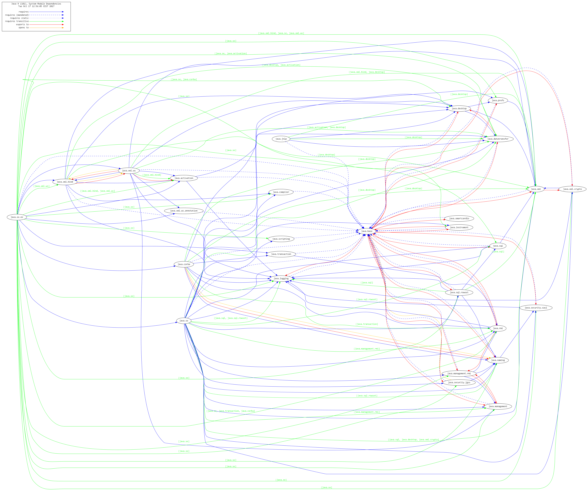

# DepVis (Java 9 Jigsaw Dependency Visualizer)

### Info
Written by [Martin Lehmann](https://github.com/MartinLehmann1971), [Kristine Schaal](https://github.com/kristines) and [Rüdiger Grammes](https://github.com/rgrammes) 

Version 0.2

see https://github.com/accso/java9-jigsaw-depvis

### What is this about?
DepVis visualizes dependencies of Java 9 Jigsaw modules as defined in 
[Project Jigsaw](http://openjdk.java.net/projects/jigsaw/) by [JSR 376]
(https://www.jcp.org/en/jsr/detail?id=376) and [JEP 261](http://openjdk.java.net/jeps/261). 
DepVis produces a [GraphViz](http://www.graphviz.org) output file (DOT file) which can be rendered with GraphViz in a separate step.

Result looks like this (in this case all Java 9 system modules (build b162) are visualized with all relationships, limited to modules with prefix "java.*"):

#### DepVis takes into account:
1. Requires/Read relationships (currently visualized as a blue arrow)
   * requires mandated to `java.base` (dashed blue arrow)
   * requires transitive (blue arrow)
2. Exports-To relationships (red)
3. Requires transitive transitivity (green arrow)
   * If `moda--requires-transitive-->modb` (blue) and `modc--requires-->moda` (blue), then also `modc--requires-->modb` (green). Note that this is currently limited to 1-transitivity.

#### Further hints:
1. DepVis can be configured, see section below.
2. A legend is written in the top left corner. As this unfortunately flips the whole graph, this is done as a separate graph.
3. A helper printer tool is also included which prints the relationship to STDOUT. 

#### Legend
![Legend] (legend.jpg)

### Setup
1. Clone this repo.
2. Install a Java 9 JDK with Jigsaw support. DepVis has been tested with b162 as of March 2017.
3. Install GraphViz 2.38.
4. If running on Windows, install a bash, like for example [Babun](https://babun.github.io/)
5. Edit file `env.sh` to configure `JAVA_HOME` and `GRAPHVIZ_HOME` (see TODO markers)
6. Call `clean.sh`, `compile.sh` and `run-vis.sh` (or `all.sh` for all in one step).
7. Output is `moduledependencies.dot` and `moduledependencies.png` (and a second file pair `...with-legend`).

### Configuration
DepVis can be configured in a configuration properties file (see depvis.properties) as follows:

1. `depvis.includeFilter`
   * comma-separated Strings
   * module names whitelist, _all_ used to be checked with `String.startsWith`
   * if not set, all modules from system and/or module-path will be used
   * example: `java.,jdk.`
2. `depvis.excludeFilter`   
   * comma-separated Strings
   * module names blacklist, _all_ used to be checked with `String.startsWith`
   * if not set, all modules from system and/or module-path will be used
   * example: `jdk.internal`
3. `depvis.useSystemModules`
   * boolean 
   * do we want to visualize modules from system (i.e. `java.*`, `jdk.*` etc.)?
4. `depvis.useModulePath`
    * boolean value
    * want to visualize modules from a module path
    * if so, `depvis.modulePath` needs to be set
5. `depvis.modulePath`
    * path Strings, separated by system's file separator) 
    * set a local module path
    * example: `/jigsaw/example/mlib`
6. `depvis.showRequires`
    * boolean 
    * want to visualize requires/reads relationships?
7. `depvis.showRequiresMandated`
   * boolean 
   * want to visualize requires/reads mandated relationships?
8. `depvis.showRequiresTransitive`
   * boolean 
   * want to visualize requires/reads transitive relationships (1-transitive)?
9. `depvis.showExportsTo`
   * boolean 
   * want to visualize exports-to relationships?
10. `depvis.outputFileName`
    * String
    * filename for the DOT output file
    * example: `/tmp/moduledependencies.dot`
11. `depvis.showLegend`
    * boolean 
    * want to visualize a legend plus title and timestamp?
    * if so, the graph will be flipped to LR
12. `depvis.diagramTitle`
    * String
    * configure a title for the diagram

### TODOs, LOP, Backlog, Ideas, ...
No software is ready, ever ;-) So here are some ideas left (any other feedback very welcome!):

- [ ] Show requires transitive dependencies with a different line style
- [ ] Include n-transitivity for requires-transitive
- [ ] Allow filtering of individual relationships (black/white listing)
- [ ] Include uses/provides relationships
- [ ] Include the module's package names
- [ ] Include a module's hash value
- [ ] Currently, DepVis only shows modules from the Observable Modules (= module path and system modules). Alternatively allow to show modules from a Configuration.
- [ ] Allow to configure colors, edge styles, node styles/shapes etc. via config file from outside (currently one needs to change Java class depvis.GraphVizHelper.java and recompile).
- [ ] Adding a GraphViz legend seems only possible with `rankdir=LR`. This settings then flips the whole graph (as it cannot be done in a subgraph only). Any way to get around this?
- [ ] Write the package name(s) to an exports-to edge
- [ ] Layouting: Any text added as label to an edge should be visualized "closely"
- [ ] Open Modules as new module type
- [ ] usage of "opens" in module-info

### Latest changes
- "requires public" in the module-info is now "requires transitive".

### Related projects
Jigsaw examples, see https://github.com/accso/java9-jigsaw-examples : Java 9 Jigsaw modules example suite

### Acknowledgments
Thx to the GraphViz team (http://www.graphviz.org) for this magic tool!

Thx also to [Kohsuke Kawaguchi](https://github.com/kohsuke) for his graphviz-api at https://github.com/kohsuke/graphviz-api!
We have forked his API to https://github.com/MartinLehmann1971/graphviz-api and made a few minor changes (mainly to avoid duplicates of GraphViz Nodes based on their ID).
